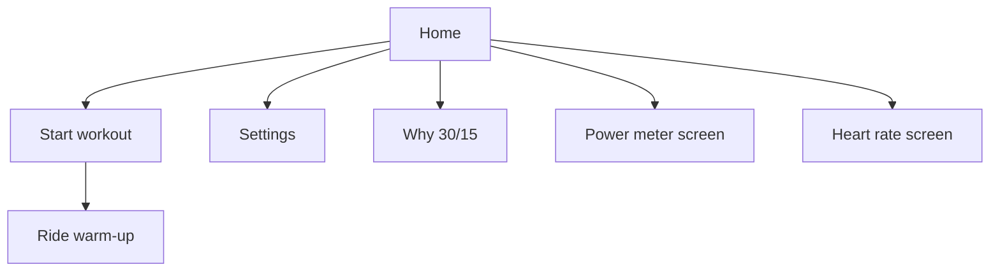

# Screens — wireframes

Portrait iPhone. Safe area respected. No tab bar.

Legend: `[ Button ]` = tappable control. `(status)` = non-interactive text.

---

## 1. Welcome (first launch only)

```
┌─────────────────────────────┐
│                             │
│     [ dusk road + bike ]    │  ← full-bleed hero, calm
│         abstract wash       │
│                             │
│          30/15              │  large title
│   Micro-intervals that      │
│   build your engine.        │
│                             │
│    [  Get started   ]       │  primary filled
│         Skip                │  text button
└─────────────────────────────┘
```

- Get started → Home (mark welcome seen).
- Skip → same destination; do not nag again.

---

## 2. Home

```
┌─────────────────────────────┐
│ 30/15                    ⚙  │  large title + Settings
│                             │
│ ┌──────────┐ ┌──────────┐   │
│ │ ⚡ Power │ │ ♥ Heart  │   │  SensorChip rows
│ │ Connected│ │ Fenix 7  │   │  tap → sensor screen
│ │  — W     │ │  — bpm   │   │  or connect flow
│ └──────────┘ └──────────┘   │
│                             │
│                             │
│      [     Start     ]      │  one primary; never disabled
│                             │  for missing sensors
│                             │
│      Why 30/15          ›   │  secondary navigation
│                             │
└─────────────────────────────┘
```

### Rules

- **No** FTP, hard W, or easy W on Home.
- Chips show connect / reconnect / live glance when available.
- Start always enabled. Missing sensors → dashes on ride, not a block.
- Why 30/15 opens the science sheet/screen.



---

## 3. Ride — warm-up / HARD / EASY (running)

```
┌─────────────────────────────┐
│         Warm-up             │  or HARD / EASY
│      phase color wash       │
│                             │
│           247               │  LIVE WATTS — largest
│            W                │
│           152               │  BPM under watts
│           bpm               │  only if HR linked; else "—"
│                             │
│           0:42              │  countdown — secondary
│                             │
│                             │
│                             │
│        [   Pause   ]        │  ONLY control while running
└─────────────────────────────┘
```

### Hierarchy (locked)

1. Live watts (top, biggest).
2. BPM under watts (same column).
3. Countdown below.
4. Pause only.

Never invent watts or BPM. Empty link → em dash.

---

## 4. Ride — paused

```
┌─────────────────────────────┐
│         HARD                │
│                             │
│           247               │
│            W                │
│           152 bpm           │
│           0:18              │  frozen countdown
│                             │
│      [   Resume   ]         │  primary
│      [    End     ]         │  secondary / destructive
└─────────────────────────────┘
```

---

## 5. Done

```
┌─────────────────────────────┐
│                             │
│        You did it.          │
│  Great focus. Strong work.  │
│                             │
│  Sets            2 × 13     │
│  Duration         24:10     │
│  Time in HARD     13:00     │
│  Time in EASY      6:30     │
│                             │
│  — Power (only if samples) —│
│  Avg / Peak / Hard vs Easy  │
│  Work kJ · sparkline        │
│                             │
│  — Heart (only if samples) —│
│  Avg / Max / Hard vs Easy   │
│                             │
│      [     Done     ]       │  saves phone-first; sync
│                             │  if signed in (no wait)
└─────────────────────────────┘
```

---

## 6. Settings (iOS inset grouped)

```
┌─────────────────────────────┐
│ < Home          Settings    │
│                             │
│ SENSORS                     │
│ ┌─────────────────────────┐ │
│ │ Power meter          ›  │ │
│ │ Heart rate           ›  │ │
│ └─────────────────────────┘ │
│                             │
│ WORKOUT                     │
│ ┌─────────────────────────┐ │
│ │ Sets          2 × 13  › │ │  default 2×13
│ └─────────────────────────┘ │
│                             │
│ TARGETS                     │
│ ┌─────────────────────────┐ │
│ │ FTP              120 W ›│ │  default 120
│ │ Hard % / W           ›  │ │
│ │ Easy % / W           ›  │ │
│ └─────────────────────────┘ │
│                             │
│ ACCOUNT (optional)          │
│ ┌─────────────────────────┐ │
│ │ Sign in / Account    ›  │ │
│ └─────────────────────────┘ │
└─────────────────────────────┘
```

---

## 7. Why 30/15

Science sheet: Rønnestad micro-intervals, time near VO₂max, not a Zone 2 replacement.
Calm typography; one dismiss / Done. No paywall language.
